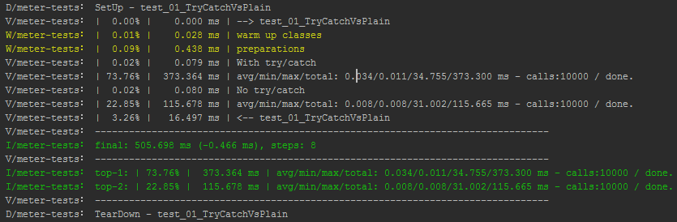

# State

[](https://travis-ci.org/OleksandrKucherenko/meter) [](https://coveralls.io/r/OleksandrKucherenko/meter?branch=master)  [](https://codecov.io/github/OleksandrKucherenko/meter?branch=master)[](https://scan.coverity.com/projects/3248)

[ ](https://bintray.com/kucherenko-alex/android/com.artfulbits%3Ameter/_latestVersion) [](http://android-arsenal.com/details/1/1787)  [](http://www.methodscount.com/?lib=com.artfulbits%3Ameter%3A%2B)

[](https://gitter.im/OleksandrKucherenko/meter?utm_source=badge&utm_medium=badge&utm_campaign=pr-badge)

Active development, started at: 2014-07-13

Current state: on hold. Collecting devs feedback.

# What is meter?

Meter - is a simple micro-benchmarking tool for Android (not only for Android, its actually for any Java project).

It was designed for Android. Meter try to make measurement an easy task, with minimal impact on total project performance.

By using it you can easily benchmark critical components of own Android Projects and select the best possible way based on real measurments, instead of making gueses. It can be easily attached to jUnits and on each run will confirm performance choices.

>
> Programmers waste enormous amounts of time thinking about, or worrying about, the speed of noncritical parts of their programs, and these attempts at efficiency actually have a strong negative impact when debugging and maintenance are considered. We should forget about small efficiencies, say about 97% of the time: premature optimization is the root of all evil. Yet we should not pass up our opportunities in that critical 3%.
>
> (C) Donald Knuth - http://en.wikiquote.org/wiki/Donald_Knuth
>

# Include Into Project

```groovy
repositories {
    maven {
        url  "http://dl.bintray.com/kucherenko-alex/android"
    }
}

dependencies {
    // ALTERNATIVE:
    //   compile(group: 'com.artfulbits', name: 'meter', version: '1.0.1.164', ext: 'aar')
    compile 'com.artfulbits:meter:+@aar'
}
```

# Changes Log

v1.0.1.164

* ADD: compare of tracked steps by Total value with custom accuracy
* ADD: JAR binray generated for Maven repository.
Hope it will resolve issues with library attaching to projects.

[Changes Log](_documentation/changes.md)

# Advanced topics

[Accuracy of Measurements](_documentation/accuracy.md)

[Configuration](_documentation/configuration.md)

[Custom Logs](_documentation/logs.md)

[Android Performance Results](_documentation/performance.md)

[Unit Testing](_documentation/testing.md)

[Proguard](_documentation/proguard.md)

# Output Preview



# Design objectives

* minimalistic code
* deployment in one file
* no support of scenarios that has more than 256 steps
* nested measurements
* measurement of loops/iterations:
* loops with known number of iterations
* loops with unknown number of iterations (round array in use, 1000 steps of loop used for average calculations)
* loop Min/Max/Average cost of iteration
* no sub-steps inside the loops, but allowed sub-measurement
* measurement limited by one thread (partly limited by class design, its just a recommendation not an actual limit)
* minimalistic allocations during benchmarking, all calculations and allocations are done only on Meter.stats() call
* logcat as standard output.  Developer can change output class instance to any required. Simple interface to inherit/implement.
* simple configuration of output formats. Boolean flags mostly.
* nanos timestamps used for time calculations, millis for time output
* support Android native traceview benchmarking/profiling

# Calls Protocol

Sample of typical micro benchmark:

```java
  // ... create/get instance for tests ...
  final static Meter sMeter = Meter.getInstance();

  public void test_00_mainProtocol() {
    // ... start the play! ...
    sMeter.start("test_00_mainProtocol");

    // ... do some warm up steps ...
    sMeter.skip("warm up of the classes");

    // ... do some logic steps #1 ...
    sMeter.beat("logic step execution #1 ");

    // ... do some logic steps #2 ...
    sMeter.beat("logic step execution #2");

    sMeter.loop(100, "reserve space for 100 loops");
    for( int i =0; i < 100; i++ ){

      // ... do some iteration logic ...
      sMeter.recap();
    }
    sMeter.unloop("");

    sMeter.finish("END of test_00_mainProtocol()");
  }
```

## Step 0 - Get Instance
All activities with micro-benchmarking should be started from call `Meter.getInstance()` - this is the entry point. You
can choose would you want to keep reference in local variable or each time call the method. Inside the method implemented
simplest cache-map `WeakHashMap<Thread, Meter>` which keeps association of thread with Meter instance. In most cases you
will need only one `Meter` instance per thread.

```java
  final Meter mMeter = Meter.getInstance();

  /** Get instance of the benchmark tool. */
  public Meter meter() {
    return mMeter;
  }
```

## Step 1 - Start and Finish
To start benchmarking you should call a corresponding method `meter().start("{comment}")` and of course to finish the job call one
proposed methods `meter().end("{comment}")` or `meter().finish("{comment}")`.

`meter().end("{comment}")` - stops benchmarking, but does not remove results from 'stack'. That allows to do some manipulations and
should be used for 'nested' measurements. After this call you should not forget to call `meter().pop()`.

`meter().finish("{comment}")` - stops benchmarking, removing 'measurement' from 'stack' and print results. This is recommended
method to call at the end of benchmark.

## Step 2 - Beats
Available two commands: `meter().beat("{comment}")` and `meter().skip("{comment}")`. First one create timestamp that
participate in calculations of execution costs, second one excluding tracked step from calculations.

So we have ability to create complex scenarios with included and excluded steps.

## Step 3 - Loops
In class exists three API methods for loops benchmarking: `meter().loop(int,"{comment}")`, `meter().unloop("{comment}")`
and `meter().recap()`. First two APIs defining the scope of the loop, third one - timestamp iteration inside the loop.

* Loops can be nested.
* If you call `loop(int,"{comment}")` - than first parameter define the quantity of iterations to track. This allows to
  benchmark without mistakes of computations.
* if you call `loop("{comment}")` - than class become prepared for loops with unknown number of iterations. Its a smart
  operation and if tracked number of iterations is less than 1000 (1 thousand) - we got computations without mistakes,
  otherwise will be always a small computation mistake.

That's it. Don't forget to call `meter().finish("{comment}")` for getting results in logcat.


# License

    Copyright 2015 Oleksandr Kucherenko
    Copyright 2005-2015 ArtfulBits, Inc. (http://www.artfulbits.com)

    Licensed under the Apache License, Version 2.0 (the "License");
    you may not use this file except in compliance with the License.
    You may obtain a copy of the License at

       http://www.apache.org/licenses/LICENSE-2.0

    Unless required by applicable law or agreed to in writing, software
    distributed under the License is distributed on an "AS IS" BASIS,
    WITHOUT WARRANTIES OR CONDITIONS OF ANY KIND, either express or implied.
    See the License for the specific language governing permissions and
    limitations under the License.
