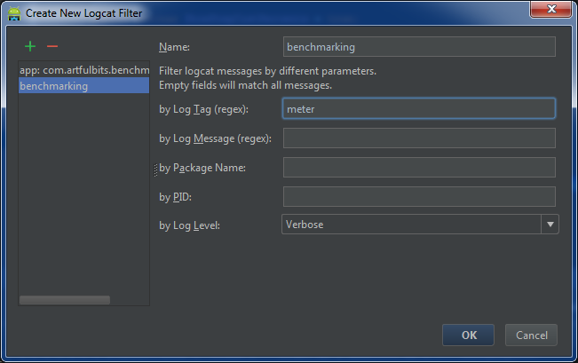

# Use benchmark tool in Unit tests

_Notes: jUnit does not support custom log messages attaching to the test results. So all the time you should think about
using some external storage or logcat._

`Sample-01` - contains set of classes that define the entry point for unit tests.

## Base class

```java
/**
 * Class designed first of all for capturing performance metrics of the tests.<br/>
 * <br/>
 * Logic:<br/>
 * <ul>
 * <li>Inside the test please use {@link Meter} class API for performance metrics capturing. Meter class automatically
 * started in {@link PerformanceTests#setUp()} and finalized in {@link PerformanceTests#tearDown()}.</li>
 * <li>Typical approach is to call {@link Meter#beat(String)} inside the test case.</li>
 * <li>{@link PerformanceTests#warmUp()} - abstract methods for executing warmUp logic. WarmUp excluded from
 * measurement.</li>
 * </ul>
 */
public abstract class PerformanceTests extends AndroidTestCase {

  protected final Meter mMeter = Meter.getInstance();

  /** {@inheritDoc} */
  @Override
  protected void setUp() throws Exception {
    super.setUp();

    Log.d(TAG, "SetUp - " + getName());

    configMeter();
    meter().start("--> " + getName());

    warmUp();

    meter().skip("warm up classes");
  }

  /** Meter class configuration adaptation. */
  protected void configMeter() {
    meter().getConfig().OutputTag = TAG;
    meter().calibrate();
  }

  /** {@inheritDoc} */
  @Override
  protected void tearDown() throws Exception {
    super.tearDown();

    meter().finish("<-- " + getName());

    Log.d(TAG, "TearDown - " + getName());
  }

  /** Warm up the test before executing it body. */
  protected abstract void warmUp();

  /** Get instance of the benchmark tool. */
  public Meter meter() {
    return mMeter;
  }
}
```

## Example of tests:

```java
/** Performance library tests. */
public class MeterTests extends PerformanceTests {
  @Override
  protected void warmUp() {
    // do nothing

    meter().getConfig().ShowStepsGrid = true;
    meter().getConfig().ShowAccumulatedTime = true;
  }

  public void test_00_Meter() {

    // sleep 1 seconds
    SystemClock.sleep(1 * 1000);

    meter().beat("test_00_Meter");
  }
}
```

## Test output:

```
D/meter-tests﹕ SetUp - test_00_Meter
V/meter-tests﹕ | 1438332934588 | 0 | 0 | 0 |  0.00% |    0.000 ms |    0.000 ms | --> test_00_Meter
W/meter-tests﹕ | 0 | 1438332944880 | 0 | 0 |  0.00% |    0.010 ms |    0.010 ms | warm up classes
V/meter-tests﹕ | 0 | 0 | 1439333294214 | 0 | 99.98% | 1000.349 ms | 1000.360 ms | test_00_Meter
V/meter-tests﹕ | 0 | 0 | 0 | 1439333478339 |  0.02% |    0.184 ms | 1000.544 ms | <-- test_00_Meter
V/meter-tests﹕ --------------------------------------------------------------------------------
I/meter-tests﹕ final: 1000.533 ms (-0.010 ms), steps: 4
V/meter-tests﹕ --------------------------------------------------------------------------------
I/meter-tests﹕ top-1: | 0 | 0 | 1439333294214 | 0 | 99.98% | 1000.349 ms | 1000.360 ms | test_00_Meter
I/meter-tests﹕ top-2: | 0 | 0 | 0 | 1439333478339 |  0.02% |    0.184 ms | 1000.544 ms | <-- test_00_Meter
I/meter-tests﹕ top-3: | 1438332934588 | 0 | 0 | 0 |  0.00% |    0.000 ms |    0.000 ms | --> test_00_Meter
V/meter-tests﹕ --------------------------------------------------------------------------------
D/meter-tests﹕ TearDown - test_00_Meter
```

## jUnit Tests, results to STDOUT

```java
public class MeterTests {
  /* [ INJECTIONS ] ================================================================================================ */
  @Rule
  public TestName mTestName = new TestName();

  /* [ MEMBERS ] =================================================================================================== */

  private Meter.Output mOutput;

  @Before
  public void setUp() {
    mOutput = new Meter.Output() {
      private StringBuilder mLog = new StringBuilder(64 * 1024).append("\r\n");

      @Override
      public void log(final Level level, final String tag, final String msg) {
        mLog.append(level.toString().charAt(0)).append(" : ")
            .append(tag).append(" : ")
            .append(msg).append("\r\n");
      }

      @Override
      public String toString() {
        return mLog.toString();
      }
    };

    mOutput.log(Level.INFO, "→", mTestName.getMethodName());
    
    // say meter to redirect all logs to STDOUT
    Meter.getInstance().setOutput(mOutput);
  }

  @After
  public void tearDown() {
    mOutput.log(Level.INFO, "←", mTestName.getMethodName());
    System.out.append(mOutput.toString());
  }
}
```

## Output Filtering


